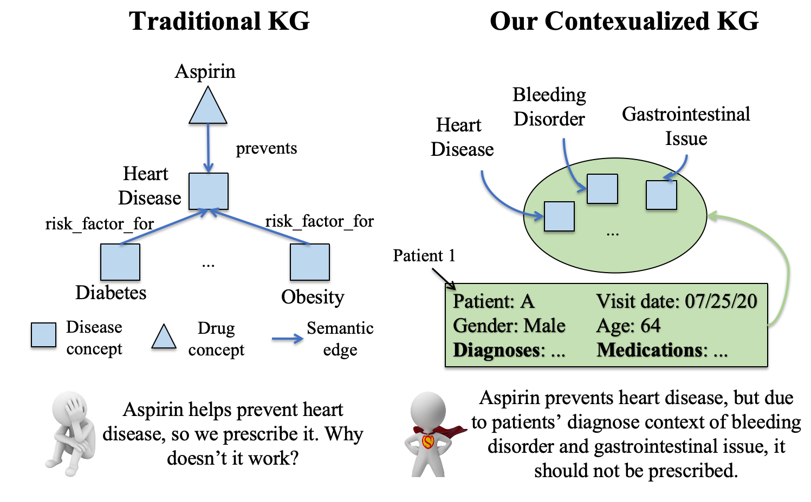

# HypKG

This is the code repo for the paper "HypKG: Hypergraph-based Knowledge Graph Contextualization for Precision Healthcare". It aims to preprocess and generate embeddings, run baseline experiments, and test contextualization methods to improve KG-based insights.

## Task Description
Knowledge Graphs (KGs) that store general factual information often lack the ability to account for important contextual details, such as the status of specific patients, which are crucial for precision healthcare. In this paper, we propose HypKG, a framework that integrates patient information, such as data from Electronic Health Records (EHRs), into KGs to generate contextualized knowledge representations for precision healthcare.

  

<em>A toy example of KG contexualization. Left: traditional KG. Right: our proposed contexualized KG.</em>

## Method Framework
HypKG is a framework designed to contextualize KG representation with patient-specific context for precision healthcare, and the pipeline is described below. First, HypKG connects KG entities with relevant context information from EHR by linking medical entities between them. Then, HypKG jointly represents KG knowledge and contextual information from EHR in a hypergraph structure, capturing key relationships between patients, features, and other patients. Finally, the node and hyperedge embeddings in the hypergraph structure are learned and optimized for downstream precision healthcare tasks.

  

<em>Overview of our proposed HypKG framework.</em>

## Directory Structure

- **KGEmbedding**: Contains scripts for generating KG embeddings.
  - **gen_embedding**: Includes embedding generation scripts (e.g., `TransE.py`, `complEx.py`, `compGCN.py`).
  - **preprocess**: Preprocessing scripts for data preparation.
  - **read_results**: Scripts to read and format embedding results.

- **Baselines**: Contains code and data for baseline experiments.
  - **data**: Datasets used in the baseline experiments.
  - **src**: Source code for dataset conversion, preprocessing, and model training.
  - **scripts**: Shell scripts to facilitate experiments (e.g., `mimic.sh`).

- **Contextualization**: Contains data and source code for HypKG's contextualization experiments.
  - **data**: Data used specifically in contextualization experiments.
  - **src**: Code to preprocess data, define models, and execute training.
  - **scripts**: Scripts for running specific contextualization tasks (e.g., `mimic_run.sh`, `promote.sh`).

- **Docs**: Documentation files for detailed project explanations and usage guides.

## Data 

We use a large-scale public knowledge graph, iBKH (from https://github.com/wcm-wanglab/iBKH), as the primary KG dataset. As for the patient context information, we contextualize the knowledge graph by integrating patient-specific data from two EHR datasets: MIMIC-III (from https://physionet.org/content/mimiciii/1.4/) and PROMOTE (private dataset). Due to the sensitive nature of medical data and privacy considerations, there are restrictions on data sharing. To gain access to the two patient-specific datasets, appropriate training and credentials may be required (https://physionet.org/). For further assistance with data access or other related inquiries, please feel free to reach out to our author team.

## Usage

### Knowledge Graph Embedding

1. **Navigate to Embedding Scripts**:
   - Go to `KGEmbedding/gen_embedding` to find implementation scripts for various embedding models:
     - **TransE**: `TransE.py`
     - **ComplEx**: `complEx.py`
     - **CompGCN**: `compGCN.py`
   - Each script contains methods to configure and train models on knowledge graph data.

2. **Data Preprocessing**:
   - Preprocess data for embedding by running scripts in `KGEmbedding/preprocess` in the intended order. For example:
     - Start with `0_ConvertToHRT.py` to format datasets correctly.

3. **Save and Analyze Embeddings**:
   - Use utilities in `KGEmbedding/read_results` to save and analyze generated embeddings.

### Concept Linking

1. **Code**:
   - Please check code from the PromptLink repo: https://github.com/constantjxyz/PromptLink. 

### Contextualization (Jointly Modeling & Learning)

1. **Organize data in specific form**:
   - Input data for the contextualization model should be organized in specific formats. Please refer to the `Contextualization/data/raw_data` folder as a reference. Note that the raw data in this folder is demonstration data intended to illustrate the required format and is not suitable for training purposes.

2. **Define and Train Models**:
   - In the `Contextualization/src` folder, find scripts for defining contextualized models, running training, and managing additional preprocessing steps.

3. **Run Training**:
   - Run `Contextualization/src/train.py` to initiate model training.
   - Customize parameters for layers, model architecture, and dataset paths within `Contextualization/src/models.py`.
   - Use scripts in `Contextualization/src/scripts/` (e.g., `mimic_run.sh`) for additional model runs, adapted to specific contexts such as MIMIC data.

### Baseline Model Training

1. **Organize data in specific form**:
   - Input data for the contextualization model should be organized in specific formats. Please refer to the `Baselines/data/raw_data` folder as a reference. Note that the raw data in this folder is demonstration data intended to illustrate the required format and is not suitable for training purposes.

2. **Train Baseline Models**:
   - Execute `Baselines/src/train.py` to train baseline models.
   - Configure model settings and dataset paths as needed within the scripts to fit your specific dataset and model requirements.
   - Use scripts in `Baselines/src/scripts/` (e.g., `mimic.sh`) for additional model runs, adapted to specific contexts such as MIMIC data.

Each component in the usage pipeline can be adapted to specific datasets or knowledge graphs by editing configuration settings within each folder.

## Requirements

- Python 3.11.5
- Required libraries listed in `requirements.txt`.

## Acknowledgements

We would like to thank the authors from AllSet (https://github.com/jianhao2016/AllSet), PromptLink (https://github.com/constantjxyz/PromptLink), Pykeen (https://github.com/pykeen/pykeen), iBKH (https://github.com/wcm-wanglab/iBKH) and SAPBERT (https://github.com/cambridgeltl/sapbert) for their open-source efforts.
